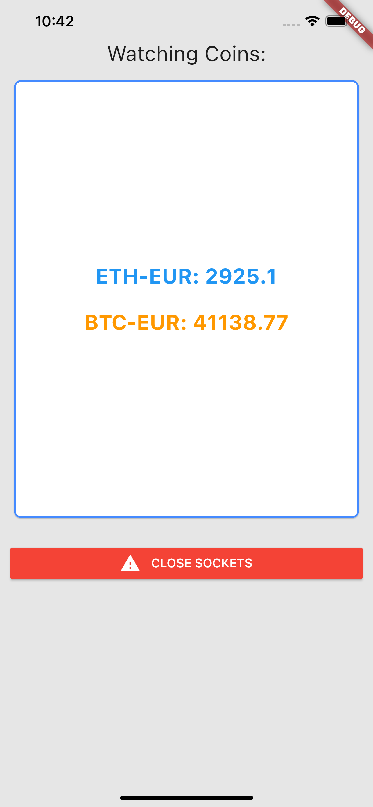

# Coinbase Socket Example

Example application using [Coinbase Pro API](https://pro.coinbase.com/) with
sockets.

In the example, we use two different Socket Channels that we can individually
open, close and add messages. However, it could all be done using the same
SocketChannel if we used a `filter` function to send different values to the
`CoinValue` widgets.